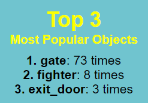
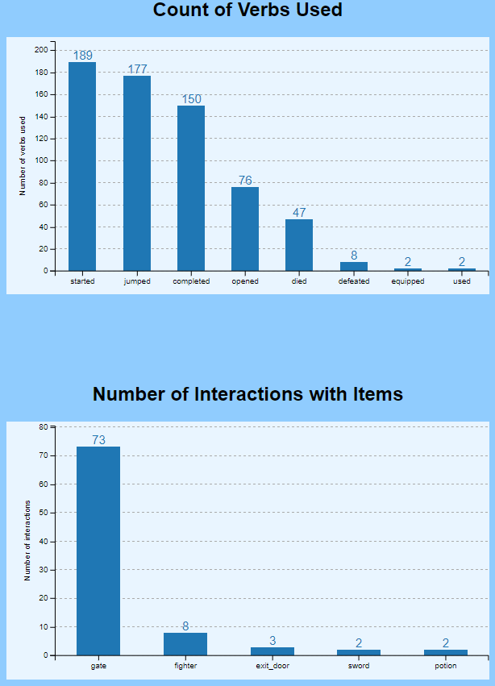
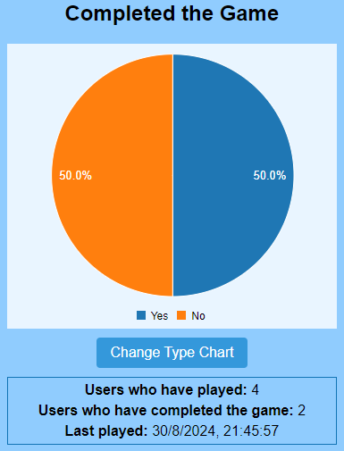
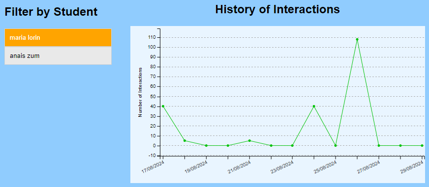

# Data Analysis Application - JaXpi
Esta aplicación web realiza análisis de datos de videojuegos JavaScript, utilizando **Vue 3** y la librería **C3.js** para generar diferentes gráficos. Esta herramienta forma parte del ecosistema JaXpi, y ha sido desarrollada para estudiar las analíticas de aprendizaje en los videojuegos educativos.

Permite a desarrolladores, profesores y estudiantes visualizar y analizar datos almacenados en una base de datos ***MongoDB***. Los datos son generados cuando los jugadores interactúan con los videojuegos, enviando trazas que siguen el estándar ***xAPI***, que luego se almacenan en la base de datos para su posterior análisis. De esta manera, los desarrolladores podrán evaluar el rendimiento de sus videojuegos, los profesores ver el rendimiento de sus estudiantes en los videojuegos y los estudiantes revisar sus propias analíticas.

## Prerrequisitos
- Tener el [servidor JaXpi](https://github.com/UCM-FDI-JaXpi/server) inicializado.  
- Tener un **videojuego** que envíe trazas con el estándar xAPI a una base de datos a través del servidor.

Por ejemplo, para enviar trazas con la demo del videojuego *Prince of JS* ([código del videojuego](https://github.com/UCM-FDI-JaXpi/demos/tree/main/PrinceJS-master)), hemos utilizado la librería JaXpi. Si quieres utilizar esta librería en tus videojuegos, ve a su [manual](https://github.com/UCM-FDI-JaXpi/lib).
**Recuerda**, para utilizar la librería JaXpi te hará falta el código del videojuego JavaScript que se quiera analizar.

## Guía de uso 
1. **Clona este repositorio** en tu equipo.
2. **Instala las dependencias** del proyecto:
````bash
npm install
````

4. **Ejecuta la aplicación web**:
````bash
npm run serve
````

5. **Accede a la aplicación**: abre en un navegador la aplicación. Verás la pantalla de 'Home' junto a un menú de navegación con diferentes opciones.

6. **Inicia sesión** según el tipo de usuario que elijas:

    - **Como desarrollador de videojuegos**: podrás ver las analíticas de los videojuegos que añadas en nuestra aplicación. Te ayudará a la hora de ver la funcionalidad de tus videojuegos, pudiendo detectar defectos en cuanto al uso de objetos o verbos, ver los tiempos que tardan en completar los diferentes niveles y cuantos han llegado al último nivel, entre otros muchos. Te permite identificar áreas de mejora en tus videojuegos. Para ello:
      - Regístrate en la aplicación como 'Developer'.
      - Inicia sesión con correo y contraseña en *Login*.
      - Añade los **videojuegos** en los que quieras realizar un análisis de sus datos de juego haciendo click en *Add game*.
      - Al añadir un videojuego, se te genera un ***Token*** que tendrás que utilizar para poder captar las trazas de juego por los diferentes usuarios. En el manual de la [librería JaXpi](https://github.com/UCM-FDI-JaXpi/lib) podrás ver como utilizarlo.
      - Ya puedes ver las analíticas de tus videojuegos una vez empiecen a ser jugados.
        **Importante:** las datos que se tratan son anónimos para respetar la privacidad de los jugadores.
      
    - **Como profesor**: la aplicación es una herramienta que puedes utilizar para realizar el seguimiento de la participación y el progreso de tus estudiantes en las diferentes sesiones de juego.
      - Regístrate en la aplicación como 'Teacher'.
      - Inicia sesión con correo y contraseña en *Login*.
      - Crea tus **clases** y **alumnos** tanto de forma manual como de forma aleatoria con un número determinado de estudiantes.
      - Una vez tengas clases creadas, podrás crear en ellas **sesiones de juego** eligiendo un juego que un desarrollador ha registrado previamente.
      - Al crear una sesión de juego, generamos **claves de sesión** únicas para cada estudiante. Debes proporcionárselas a tus estudiantes para que puedan jugar registrados en el videojuego y acceder a la aplicación para ver sus propias analíticas.
    
    - **Como estudiante**  
      Para poder utilizar la aplicación y visualizar tus propias analíticas, tu profesor tendrá que darte una clave de sesión por cada sesión de juego que haya creado con la clase a la que perteneces.
      - Inicia sesión con una de tus claves de sesión en *Login as student*.
      - Si ya has jugado a los videojuegos con alguna de tus claves, podrás ver en tus analiticas las áreas que te resultan mas difíciles así como las áreas que te resultan más fáciles para tener una visión global de tu rendimiento en los diferentes videojuegos.

## Representación visual de los datos
En la aplicación web se muestran diferentes tipos de representaciones visuales de las analiticas realizadas en gráficos y tablas. Algunos ejemplos que puedes encontrar:  
1. **Objetos más utilizados**: se muestra un ranking con los 3 objetos más utilizados.  

   


2. **Interacciones con objetos/verbos**: utilizamos diagramas de barras para mostrar el número de interacciones que se realizan con los objetos/verbos que presenta el juego.  

   


3. **Partidas empezadas y ganadas**: a través de un gráfico de pastel mostramos el porcentaje de partidas que se han empezado en comparación con las partidas ganadas. Las partidas ganadas hacen referencia a las partidas que han completado el último nivel de juego.  

   


4. **Tiempo por nivel (medio y mejor)**: dibujamos en el eje x de los gráficos de barras los niveles de juego, y en el eje y, el tiempo en milisegundos o segundos.  


5. **Histórico de interacciones**: en un gráfico de líneas mostramos la actividad de un estudiante a lo largo del tiempo.  

   


6. **Registro de últimas interacciones de los jugadores**: vemos en tablas las últimas trazas recibidas de las jugadas de los estudiantes.


   
**Nota**: Las representaciones varían según el tipo de usuario que inicie sesión, ya que cada uno tiene unas necesidades diferentes al realizar la analítica de datos.
