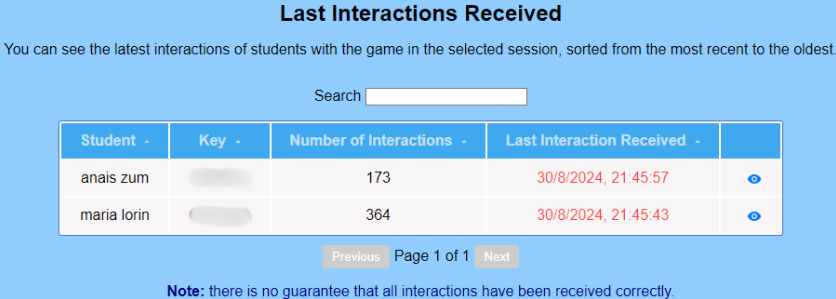

# Data Analysis Application - JaXpi
This web application performs data analysis of JavaScript video games, using **Vue 3** and the **C3.js** library to generate different charts. This tool is part of the JaXpi ecosystem, and has been developed to study learning analytics in educational video games.

It allows developers, teachers and students to visualize and analyze data stored in a **MongoDB** database. The data is generated when players interact with the video games, sending traces that follow the ***xAPI*** standard, which are then stored in the database for later analysis. In this way, developers will be able to evaluate the performance of their video games, teachers will be able to see the performance of their students in the video games and students will be able to review their own analytics.

## Prerequisites
- Have the [JaXpi server](https://github.com/UCM-FDI-JaXpi/server) initialized.  
- Have a **video game** that sends traces with the xAPI standard to a database through the server.

For example, to send traces using the *Prince of JS demo* ([video game code](https://github.com/UCM-FDI-JaXpi/demos/tree/main/PrinceJS-master)), we used the JaXpi library. If you want to use this library in your video games, refer to its [manual](https://github.com/UCM-FDI-JaXpi/lib). **Note**, to use the JaXpi library you will need the JavaScript code of the video game you want to analyze.

## Guide 
1. **Clone this repository** on your computer.
2. **Install the project dependencies**:
````bash
npm install
````

4. **Run the web application**:
````bash
npm run serve
````

5. **Access the application**: Open the application in a browser. You will see the 'Home' screen along with a navigation menu with different options.

6. **Log in** according to the user type you choose:

    - **As a game developer**: You will be able to view the analytics of the video games you add to our application. It will help you to see the functionality of your video games, being able to detect defects in the use of objects or verbs, see the time it takes to complete the different levels and how many have reached the last level, among many others. It allows you to identify areas for improvement in your video games. To do this:
      - Register in the application as a 'Developer'.
      - Log in with email and password in *Login*.
      - Add the **video games** you want to analyze by clicking on *Add game*.
      - When you add a video game, a ***Token*** is generated that you will have to use to capture traces of the game played by the different users. You can see how to use it in the [JaXpi library](https://github.com/UCM-FDI-JaXpi/lib) manual.
      - You can now view the analytics of your video games once they start being played.
        **Important:** the data processed is anonymous to respect players' privacy.
      
    - **As a teacher**: The app is a tool you can use to track your students' participation and progress in different game sessions.
      - Register in the app as a 'Teacher'.
      - Log in with email and password in *Login*.
      - Create your **classes** and **students** either manually or randomly with a set number of students.
      - Once you have created classes, you can create **game sessions** in them by choosing a game that a developer has previously registered.
      - When creating a gaming session, we generate  unique **session keys** for each student. You must provide these keys to your students so they can play the game logged in and access the application to view their analytics.
    
    - **As a student**: To use the application and view your analytics, your teacher will need to give you a session key for each gaming session created for your class.
      - Log in with one of your session keys in *Login as Student*.
      - If you have already played a video game with any of your keys, you will be able to see in your analytics the areas that are most difficult for you as well as the areas that are easiest for you to have an overall view of your performance in those video games.

## Visual Representation of Data
The web application displays different types of visual representations of the analytics in charts and tables. Some examples you can find: 
1. **Most Used Objects**: A ranking with the 3 most used objects is shown.

      
    <br>
2. **Interactions with Objects/Verbs**: We use bar charts to display the number of interactions with the objects/verbs presented in the game.  

      
    <br>
3. **Started and Won Games**: A pie chart shows the percentage of games started compared to games won. Won games refer to games that have completed the final level.

      
    <br>
5. **Time per Level (Average and Best)**: Displays the game levels on the x-axis of bar charts and time in milliseconds or seconds on the y-axis.

    
    <br>
6. **Interaction History**: Shows student activity over time in a line chart.

    
    <br>
7. **Record of Latest Player Interactions**: We see in tables the last traces received from the students' moves.

      
    <br>
**Note**: Representations vary according to the type of user logged in, as each user type has different needs for data analysis.
